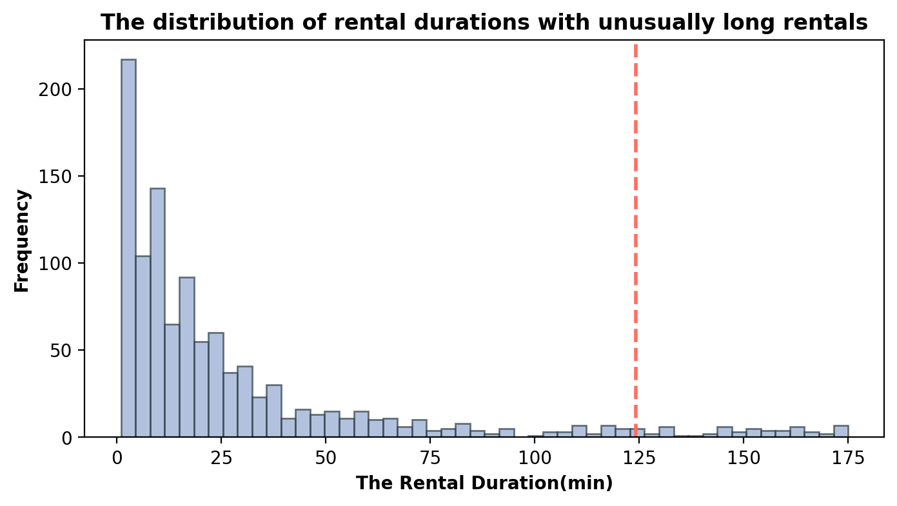
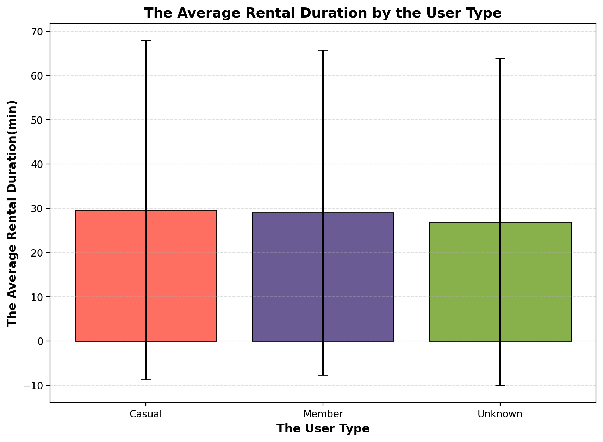
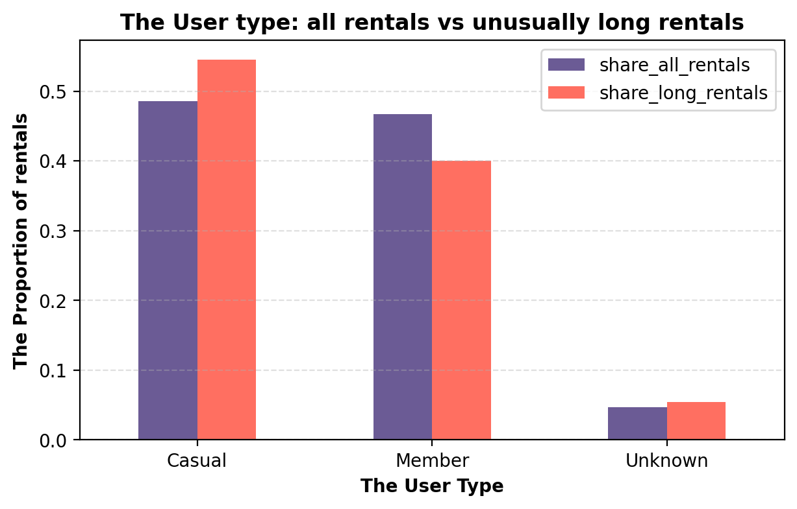

Perfect — you’re **very close to the final, professional README**.
I’ll now give you the **clean, corrected, and recruiter-ready final version** with:

* fixed markdown structure
* improved wording (UK data-analyst tone)
* corrected folder name (`data/` not `dataset/`)
* properly closed code block
* polished intro summary

---

# ✅ FINAL UPDATED README (copy-paste this)

```md
> Exploratory data analysis and SQL-based investigation of bike rental behaviour to uncover peak usage patterns, user differences, and long-duration anomalies that inform operational decision-making.

# Bike Rental Usage Analysis & Outlier Investigation

## Objective
Analyse bike rental behaviour to:

- Identify **peak usage patterns across time**
- Understand **rental duration differences between user groups**
- Detect **unusually long rentals** using statistical thresholds
- Investigate operational factors associated with long-duration trips

This project demonstrates how exploratory analytics can generate **practical, data-driven business insights**.

---

## Dataset
- Bike rental trip records containing **temporal, user, and station attributes**  
- Supplementary metadata describing **rental conditions and station details**  
- Data cleaning performed to remove **missing or invalid duration values**

---

## Methodology
- Exploratory Data Analysis using **Pandas** and **Matplotlib**  
- Identification of **peak hourly demand patterns**  
- Statistical comparison of **rental duration by user type**  
- Detection of long rentals using the **95th percentile rule**  
- Investigation of anomalies via **SQL queries (SQLite)**  
- Visualisation of behavioural patterns for interpretation  

---

## Key Insights

### Peak Hourly Usage


### Rental Duration by User Type


### Long Rentals by User Type


### Stations Associated with Long Rentals


---

## Tech Stack
**Python:** pandas, numpy  
**Visualisation:** matplotlib  
**Querying:** SQLite, SQL  
**Environment:** Jupyter Notebook  

---

## Business Insight
Long-duration rentals are disproportionately associated with **specific user groups and stations**, indicating opportunities for:

- Targeted **pricing optimisation**
- Improved **operational monitoring**
- Data-driven **resource allocation and planning**

These findings highlight the role of **exploratory analytics in real-world decision support**.

---

## Project Structure

```

qub-bike-rental-usage-analysis/
│
├── data/                # Raw datasets
├── notebooks/           # Analysis notebook
├── assets/              # Generated visualisations
├── reports/             # Exported HTML report
├── requirements.txt     # Python dependencies
└── README.md

````

---

## Reproducibility

To reproduce this analysis locally:

```bash
git clone <repo-link>
cd qub-bike-rental-usage-analysis
pip install -r requirements.txt
jupyter notebook
````

Open the notebook inside the **`notebooks/`** folder and run all cells.

---

## Author

**Gaurav Singh Airy**
MSc Data Analytics — Queen’s University Belfast
[LinkedIn](https://www.linkedin.com/in/gaurav-airy-5b91b8193)

```

